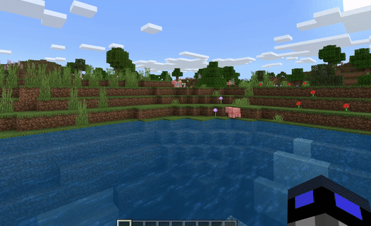
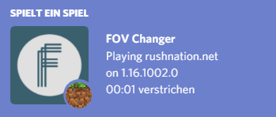

<div align="center"><center>


[](https://testing.xroix.me/api/versions)
[](https://testing.xroix.me/api/versions)
[](https://github.com/xroix/MCBE-Win10-FOV-Changer/releases/latest)
[](https://discord.gg/H3hex27)

A zoom mod for **Minecraft: Bedrock Edition** on Windows 10/11.

*[Join our discord](https://discord.gg/H3hex27) for the latest information.*

</center></div>

## Features

### Customizable Zoom

Ever wanted to see things at a distance? FOV-Changer lets you zoom in when pressing a keybind of your choice.



### Discord Rich Presence

Optionally, FOV-Changer will let you showcase currently connected servers on Discord!



### Supporting 90+ Minecraft Versions

FOV-Changer has been updated to every new Minecraft version since 2020 (except beta and preview builds). When a new version is released, you will only have to start FOV-Changer as usual. As long as a dev has added the needed patch to the [database](https://github.com/xroix/fov-changer-db), it will automatically get everything it needs.


## Installation

You can use this [direct link](https://www.github.com/XroixHD/MCBE-Win10-FOV-Changer/releases/latest/download/FOV-Changer.zip ) to download FOV-Changer. Alternatively, you can choose the latest stable version manually in the [Github Releases](https://www.github.com/XroixHD/MCBE-Win10-FOV-Changer/releases/latest).

After downloading, extract the ZIP archive in order to run the executable `FOV-Changer.exe`. As of now, the FOV-Changer client must be opened and connected every time you play Minecraft.


## Developer Guide

### Running it with Python

1. Make sure to have [Python 3.12](https://www.python.org/downloads/) installed on your machine. Other versions may work, but have not been tested!

2. Since we are on Windows, please execute commands in all steps using the Powershell. It reduces the amount of headaches.

3. Download this repository as an [zip](https://github.com/xroix/MCBE-Win10-FOV-Changer/archive/refs/heads/master.zip), or clone it with Git:
   
```bash
git clone https://github.com/xroix/MCBE-Win10-FOV-Changer.git
```

4. (optional) Create a virtual environment inside the project files by running following commands. Note that every time you open a new terminal session, you will need to run the second command again to reactivate the virtual environment!

```bash
python -m venv venv
```
```bash
.\venv\Scripts\Activate.ps1
```

5. Install all required packages using pip.

```bash
pip install -r requirements.txt
```

6. Run the main entrypoint using Python to start FOV-Changer.

```bash
python run.py
```

### Creating an executable yourself

In order to package FOV-Changer source files into a single executable, `FOV-Changer.exe`, please follow all steps from the [last section](#running-it-with-python) to create a working Python environment.

1. Afterwards, inside a Powershell session, run the following command to freeze/package all source files using [PyInstaller](https://github.com/pyinstaller/pyinstaller). Please note that in the last section we have installed a sufficiently out-dated PyInstaller version, so that the bootloaders it bundles have already been whitelisted by Microsoft Defender, preventing false positives.

```bash
pyinstaller --clean run.spec
```

2. After completion, you can safely ignore the created `./build/` directory; it only contains temporary files. More importantly, inside `./dist/` you can find the created executable, `FOV-Changer.exe`.

### Adding support for new Minecraft versions

FOV-Changer relies on [multi-level memory pointers](https://www.youtube.com/watch?v=_W0xdVO8-j4) to traverse Minecraft's memory to find addresses/places where FOV, Hide-Hand, Sensitivity, Connected Server and Port are stored. Unfortunately, this approach is prone to break whenever Minecraft updates. All offsets of the required pointers will change. After all, Mojang updating their source code will make the binary different, forcing us provide new offsets on every new release.

Hence, FOV-Changer requests these pointers and their offsets every time it encounters a new Minecraft version from an API, https://fov.xroix.me/docs. However, this API only functions as middle-man to ensure backwards-compatiblity to old FOV-Changer clients. The main database for all pointers and offsets can be found at https://github.com/xroix/fov-changer-db.

In the future, there will be more documentation on how to find new offsets so that more people can contribute to the collection.


## Disclaimer

Please use this software at your own risk.
This project is not affiliated with Minecraft, Mojang or Microsoft.
